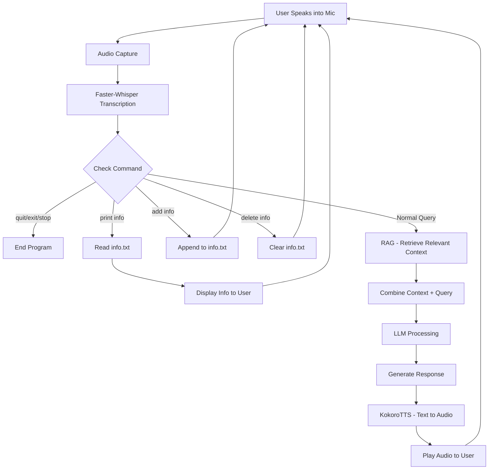

# Voice AI Agent

A local, voice-driven AI assistant built around `voice_ai.py`.

It listens from your microphone, transcribes speech with Whisper, retrieves relevant local knowledge (RAG), queries a local LLM through LM Studio, and speaks responses back with Kokoro TTS.

## High-Level Architecture Diagram



## Features

- Real-time microphone capture with simple Voice Activity Detection (VAD) (stop on silence)
- Speech-to-text with `faster-whisper`
- Retrieval-Augmented Generation (RAG) over local documents
- Local LLM inference via LM Studio OpenAI-compatible endpoint
- Text-to-speech output with Kokoro
- Multi-turn conversation memory in-session
- Voice commands for knowledge management (`add info`, `delete info`, `print info`)

## How It Works

1. Record mic audio until silence is detected.
2. Transcribe audio to text with Whisper.
3. Retrieve top-k relevant chunks from `knowledge/` using embeddings + FAISS.
4. Send user message + retrieved context to LM Studio.
5. Convert assistant response to speech and play it.

## Project Structure

- `voice_ai.py`: Main end-to-end voice assistant loop
- `knowledge/`: Local files used by RAG (`.pdf`, `.docx`, `.txt`, `.md`)
- `examples/`: Reference audio and sample assets for `IndexTTS`
- `pyproject.toml`: Dependencies managed by `uv`

## Requirements

- Python 3.10+
- `uv` package manager
- Working microphone + speaker
- LM Studio running locally with a loaded chat model
- Optional NVIDIA GPU for faster Whisper/TTS

## Quick Setup

```powershell
git clone https://github.com/ryan1604/voice-ai-agent
cd vai
uv sync
uv run voice_ai.py
```

## LM Studio Setup

`voice_ai.py` calls:

- Endpoint: `http://localhost:1234/v1/chat/completions`
- Model field: `MODEL_NAME`

Before running:

1. Start LM Studio local server.
2. Load a chat model in LM Studio.
3. Set `LMSTUDIO_MODEL_NAME` in `voice_ai.py` to your loaded model ID if required by your LM Studio config.

## Knowledge Base (RAG)

By default, documents are loaded from `knowledge/` and split into chunks, embedded with `all-MiniLM-L6-v2`, and indexed with FAISS.

Supported file types:

- `.pdf`
- `.docx`
- `.txt`
- `.md`

Useful voice commands during runtime:

- `add info`: Dictate a line to append to `knowledge/info.txt`
- `delete info`: Delete `knowledge/info.txt` (with confirmation)
- `print info`: Print contents of `knowledge/info.txt`
- `quit` / `exit` / `stop`: End session

## Configuration

Main settings are at the top of `voice_ai.py`:

- Audio/VAD: `SAMPLE_RATE`, `LISTEN_TIMEOUT`, `PHRASE_TIMEOUT`, `SILENCE_THRESHOLD`
- STT: `WHISPER_MODEL_SIZE`, `WHISPER_DEVICE`, `WHISPER_COMPUTE_TYPE`
- LLM: `LMSTUDIO_BASE_URL`, `LMSTUDIO_MODEL_NAME`, `SYSTEM_PROMPT`
- RAG: `KNOWLEDGE_DIR`, `EMBED_MODEL_NAME`, `TOP_K`
- TTS voice: Kokoro voice ID in `tts_generate_and_play_kokoro()`

## Notes on TTS Backends

`voice_ai.py` includes two TTS paths:

- Kokoro (active)
- IndexTTS2 (not included in this repository, not used due to slower inference speed)

If you want to try IndexTTS2, install it yourself in this project directory:

```powershell
git clone https://github.com/index-tts/index-tts.git .
git lfs pull
```

Important:

- Do not overwrite your `pyproject.toml` and `uv.lock`. Back them up before cloning, then restore your versions if needed.
- IndexTTS installation can produce environment- or machine-specific errors. You will need to resolve those on your own.

## Troubleshooting

- `Connection error to LM Studio`
  - Confirm LM Studio server is running at `http://localhost:1234`
  - Confirm a chat model is loaded
- `No speech detected`
  - Increase mic input level
  - Lower `SILENCE_THRESHOLD`
- `CUDA / device errors`
  - Switch Whisper settings to CPU in `voice_ai.py`
- `No RAG context returned`
  - Ensure `knowledge/` exists and contains supported document types

## Typical Run Flow

```text
[REC] Listening...
[STT/User] Transcription: "..."
[LLM] Thinking...
Assistant: ...
[TTS-Kokoro] Playing audio...
```

## Tech Stack

- `faster-whisper` for STT
- `sentence-transformers` + `faiss-cpu` for retrieval
- `pypdf`, `python-docx`, `markdown`, `beautifulsoup4` for document ingestion
- `requests` for LM Studio API calls
- `kokoro` + `sounddevice`/`soundfile` for TTS playback

## Further improvements

- Let the LLM decide whether retrieval is needed per query, instead of always injecting knowledge context.
- Add support for more knowledge file types (for example `.pptx`, `.xlsx`, `.html`, `.csv`).
- Save embeddings and the FAISS index to disk to avoid rebuilding vectors on every run.
- Implement incremental indexing when files are added, edited, or removed in `knowledge/`.
- Add citation-aware responses (return source file and page/section in final answers).
- Add configurable retrieval settings (`chunk_size`, overlap, `TOP_K`) via CLI args or a config file.
- Add reranking of retrieved chunks before LLM generation for better relevance.
- Add automated tests for ingestion, chunking, retrieval, and command flows.

## License

This project is licensed under the MIT License. See [LICENSE](LICENSE) for details.
